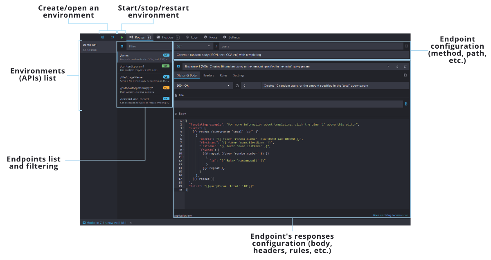
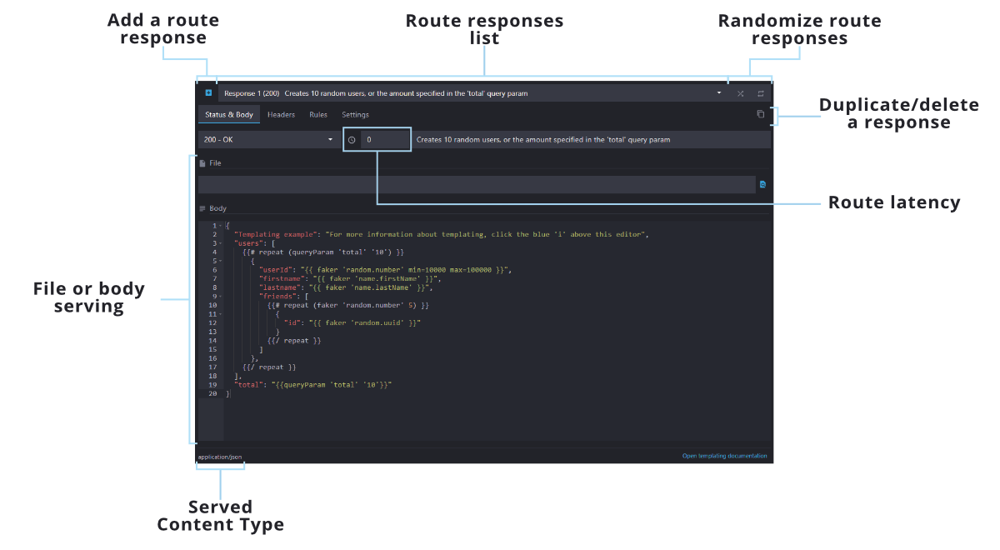
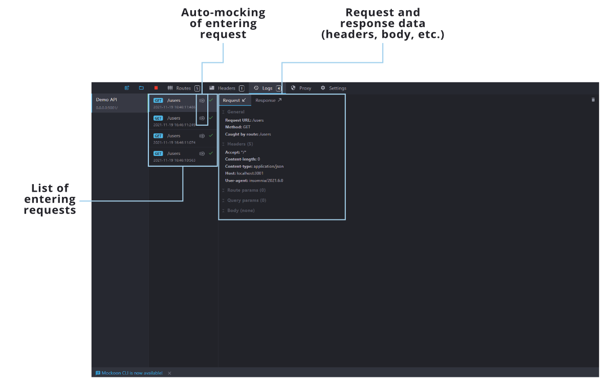
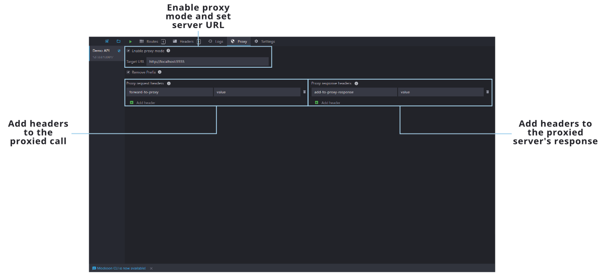
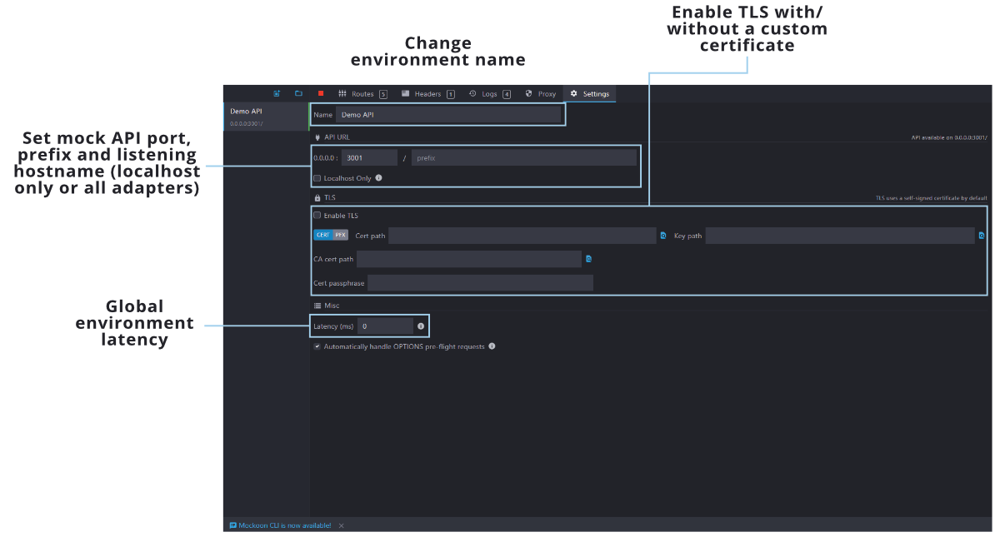
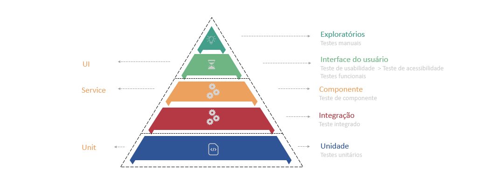
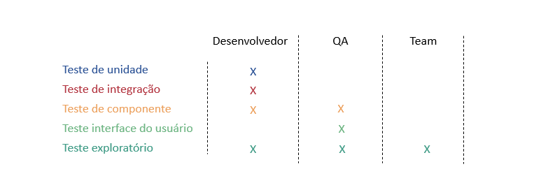

# Mockando APIs externas com mockoon

Esta poc se trata de como mockar uma conexão externa utilizando a ferramenta (Mockoon)[https://mockoon.com/]

[Documentação](https://mockoon.com/docs/latest/gui-cheat-sheet/)

[Features](https://mockoon.com/features/)

**Interface**

## Introdução:

Teste Automatizado deve ser considerado como uma parte essencial no processo de desenvolvimento de um software moderno, onde as mudanças são constantes e necessárias. Os testes dão a segurança para equipe de desenvolvimento consiga implementar as mudanças solicitadas pelo negócio sem quebrar o que já está funcionando.

A piramide de testes foi criada por Martin Fowler e ela tem como objetivo nortear os diversos niveis de testes de uma aplicação, com ela também conseguimos estimar os custos de cada teste e a quantidade de testes que devemos ter para que nossa aplicação tenha um ciclo de vida saúdavel.

**Testes unitarios**

São aplicados na menor unidade de código possivel (métodos ou funções). São com os testes unitarios que testamos as regras de negocios e garantimos que as mesmas estão funcionando.

**Testes de integração**

Verifica se uma funcionalidade está realmente funcionando corretamente, ou seja, testa um conjunto de métodos necessários para que algo aconteça.

Por exemplo: uma classe responsável por  "pegar" um conjunto de dados em uma api e transformar em um XML. A classe terá um método para conexão com a api e outro método  para a transformação dos dados em XML. O teste verificará se os dois métodos estão trabalhando em conjunto, o componente responsável realizará uma conexão real a uma api externa  e entregará estes dados para que o método formate os dados.

